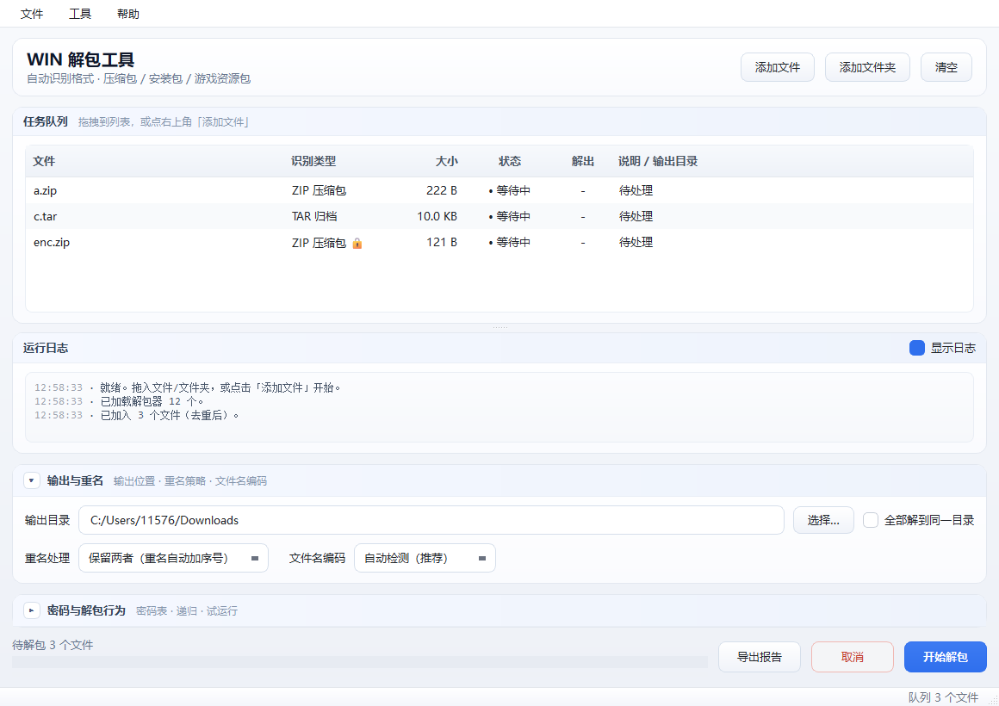

# WIN 解包工具


**Windows 端综合解包工具** —— 自动识别格式，一站式处理**通用压缩包 / 安装包 / 游戏资源包**。

GUI 界面 + 命令行双模式，支持拖拽批量、密码表爆破、递归解包、进度日志与报告导出。

**开发者友好**：仓库内含 [打包脚本](build.bat) 与 [启动脚本](start.bat)。

**免安装**：目标机器无需 Python、无需 VC++ 运行库，单个 exe 拷走即可使用。

**许可**：[MIT](LICENSE) —— 可自由使用、修改、分发与商用。

## 下载

到 [**Releases**](../../releases) 下载 `WinUnpack-win64.zip`，解压后双击 `WinUnpack.exe`。



---

## 功能特性

| 能力 | 说明 |
|---|---|
| 格式自动识别 | 读取**文件魔数**而非扩展名，含尾部 EOCD 探测（可识别自解压包尾部的内嵌 ZIP） |
| 通用压缩包 | ZIP / 7z / RAR / TAR / GZip / BZip2 / XZ / LZMA / Zstd / CAB / ISO9660 |
| 安装包 | PE 自解压（WinRAR SFX、7-Zip SFX、NSIS、Inno Setup、InstallShield）、MSI |
| **托管 .NET 程序** | `.NET 程序集`单列一类：还原**内嵌托管资源**（`ManifestResource`，逐字节无损）+ 导出程序结构（程序集引用 / 类型方法清单 / 字符串字面量）；并**自动调用随包携带的 ILSpy** 把 IL 反编译回 C#，无需手工安装反编译器 |
| 游戏资源包 | 魔数雕刻：在 `.pak/.npk/.dat/.bundle` 等私有包中定位并提取内嵌标准归档；支持插件扩展专用格式 |
| 加密包 | 密码表批量尝试（ZIP ZipCrypto、7z AES、RAR） |
| 中文文件名 | **非 UTF-8 成员名自动回退**（utf-8 → gbk → big5 → shift_jis），修复国产压缩包中文名乱码 |
| 安全防护 | Zip Slip 路径穿越拦截、成员名清洗、保留设备名处理、超长文件名截断、写盘失败自动清理半成品 |

---

## 支持的格式与实现方式

| 类型 | 格式 | 实现方式 |
|---|---|---|
| 压缩包 | ZIP、TAR、GZip、BZip2、XZ、LZMA | 原生（Python 标准库） |
| 压缩包 | 7z（含 AES 加密） | `py7zr` + `pycryptodomex` |
| 压缩包 | RAR | `rarfile`（需系统 `unrar`/`bsdtar`，缺失时转外部 7-Zip） |
| 压缩包 | Zstd | `zstandard` |
| 压缩包 | CAB（NONE / MSZIP） | **自研解析器**（LZX / Quantum 转外部 7-Zip） |
| 镜像 | ISO9660（Joliet / Rock Ridge） | **自研解析器** |
| 安装包 | PE 自解压、NSIS、Inno Setup、InstallShield | **指纹识别 + 内嵌归档雕刻** |
| 安装包 | MSI | OLE 流枚举（`olefile`）+ 内嵌 CAB 雕刻 |
| 托管程序 | .NET 程序集（WPF / WinForms / 控制台，含单文件） | **自研 PE+CLR 指纹 + `dnfile` 解析元数据**，还原内嵌托管资源 |
| 资源包 | `.pak` `.npk` `.dat` `.bundle` `.wad` `.vpk` `.mpq` … | **魔数雕刻** / 插件 |

---

## 快速开始

### 方式一：直接使用成品（推荐）

到 [**Releases**](../../releases) 下载 `WinUnpack-win64.zip`，**无需安装 Python**：

```
WinUnpack/                       # 解压后的目录，可直接拷到任意位置使用
├── WinUnpack.exe                # 图形界面版：双击即用，不会弹出终端窗口
├── WinUnpack-CLI.exe            # 命令行版：控制台程序，体积更小
├── plugins/                     # 自定义格式插件目录（放 .py 即可扩展格式）
├── tools/ilspycmd/              # 随包携带的 .NET 反编译器（解包 .NET 程序时自动调用）
├── docs/                        # 界面截图与路线图
├── src/                         # 完整源码（便于二次开发；删掉不影响运行）
├── README.md
└── requirements.txt             # 仅在「源码运行/重新打包」时需要
```

双击 `WinUnpack.exe` 打开界面；命令行操作用 `WinUnpack-CLI.exe`：

```bat
WinUnpack-CLI.exe -i sample.zip
WinUnpack-CLI.exe sample.zip -o D:\out -p 123456
```

> **为什么分成两个 exe？**
> - `WinUnpack.exe` 采用 **GUI 子系统** —— 双击时操作系统根本不会创建控制台，从根源上杜绝黑窗；
> - `WinUnpack-CLI.exe` 采用 **控制台子系统** —— 保证命令行输出、阻塞等待与退出码语义完整，
>   且不含界面依赖，体积更小。
>
> 两者功能完全一致，按使用场景选择即可。若在 cmd 中调用 `WinUnpack.exe`，程序会尝试挂回
> 父控制台以输出结果；挂不上时会弹窗提示改用 `WinUnpack-CLI.exe`。

### 方式二：源码运行（ clone 仓库后运行 ）

*注意：此方式需要手动下载环境依赖*

直接**双击根目录的 `Start.bat`** 就能打开图形界面 ：

| 命令 | 作用 |
|---|---|
| 双击 `Start.bat` | 打开图形界面（用 `pythonw` 启动，不挂黑窗） |
| `Start.bat console` | 以控制台方式运行，便于查看报错 |
| `set WINUNPACK_PYTHON=D:\env\Scripts\python.exe` | 手动指定解释器后再运行 `Start.bat` |

`Start.bat` 的 Python 查找顺序：`WINUNPACK_PYTHON` 环境变量 → 本机 `python-path.txt`
（可选，已 gitignore）→ 已激活的虚拟环境（`VIRTUAL_ENV`）→ 项目内 `.venv` / `venv` / `env`
→ PATH 中的 `python` / `python3`。都找不到时会打印出创建环境的命令。

手动创建环境：

```bat
python -m venv .venv
.venv\Scripts\python -m pip install -r requirements.txt
Start.bat
```

---

### 命令行用法

打包版用 `WinUnpack-CLI.exe`（源码运行用 `python src\winunpack_cli.py`）：

```bat
:: 仅探测格式（不解包）
WinUnpack-CLI.exe -i sample.zip game.dat setup.exe

:: 解包（默认输出到 <文件名>_unpacked）
WinUnpack-CLI.exe sample.zip

:: 指定输出目录 + 密码表 + 递归解包 + 导出报告
WinUnpack-CLI.exe D:\packs -o D:\out --merge -r -p 123456 --pwfile pwd.txt --report r.csv

:: 只预演不写文件，JSON 输出便于管道处理
WinUnpack-CLI.exe D:\packs --dry-run --json

:: 已存在文件不覆盖、不重命名，直接跳过
WinUnpack-CLI.exe pack.zip --conflict skip

:: 中文名乱码时强制指定编码
WinUnpack-CLI.exe legacy.zip --encoding gbk
```

| 参数 | 说明 |
|---|---|
| `-i, --inspect` | 仅探测格式，不解包 |
| `-n, --dry-run` | 试运行：只探测并给出输出计划，不写任何文件 |
| `-o, --output` | 输出目录（默认 `<文件名>_unpacked`） |
| `--merge` | 全部解到同一目录 |
| `--conflict` | 重名策略：`rename`（默认，保留两者）/ `overwrite` 覆盖 / `skip` 跳过已存在 / `newer` 较新者胜 |
| `--overwrite` | 等价于 `--conflict overwrite`（保留以兼容旧脚本） |
| `--encoding` | 成员名编码：`auto`（默认，自动回退）或 `gbk` / `utf-8` / `big5` / `shift_jis` |
| `-r, --recursive` | 递归解包嵌套压缩包 |
| `--max-depth` | 递归最大层级（默认 3） |
| `-p, --password` | 密码，可重复传入 |
| `--pwfile` | 密码字典文件（每行一个） |
| `--report` | 导出结果到 `.csv` / `.json` / `.txt` |
| `--json` | 把结构化结果打印到标准输出（过程日志改走 stderr） |
| `--gui` | 强制启动图形界面 |

退出码：`0` 全部成功 / `1` 存在失败 / `2` 无可处理文件 / `3` 存在需密码项 / `4` GUI 启动失败。

---

## 已知限制

- **无法识别的私有格式**：仅凭魔数雕刻无法解析所有专有资源包。命中失败时明确提示需要专用插件，不伪报成功。
- **.NET 程序集的代码**：内嵌资源与结构信息随解包一起产出；C# 源码由随包携带的 ILSpy
  反编译（`csharp/` 目录），需要目标机器装有 **.NET 8 运行时**，否则该步骤自动跳过并说明原因。
  若程序集被混淆或加壳（元数据 `BSJB` 缺失），会明确报「不支持」而不是给出错误结果。
- **原生编译的单一可执行文件**（Go / Rust / C++ 直接编译，或经 Enigma、VMProtect 等加壳）：
  机器码无法还原为源码，也提取不到资源，工具会如实报告，不会伪报成功。
- **CAB 的 LZX / Quantum 压缩**：原生实现仅覆盖 NONE 与 MSZIP，其余转外部 7-Zip；未安装时返回「不支持」。
- **RAR**：`rarfile` 需要系统 `unrar`/`bsdtar` 后端；缺失时转外部 7-Zip。
  RAR4 的非 UTF-8 成员名依赖 `rarfile` 自身的解码，乱码时可用 `--encoding` 显式指定。
- **WinZip AES 加密 ZIP**：Python 标准库不支持，需外部 7-Zip。
- **分卷 CAB**：跨卷文件可能缺失，结果中会标注。
- **ISO 镜像**：仅支持 ISO9660（Joliet / Rock Ridge），不支持 UDF。
- **7z 的非覆盖策略**：需先解到暂存目录再按规则归位，会额外占用一份临时磁盘空间。
- 外部 7-Zip 路径可用环境变量 `SEVENZIP_PATH` 指定。
- **临时空间**：单文件 exe 每次启动会把自己解包到 `%TEMP%\_MEIxxxxx`（约 110 MB）。
  退出时本应自动删除，但**实测正常关闭也可能残留** —— PyInstaller onefile 在 Windows 上
  删除临时目录时会因 DLL 仍被占用而失败。长期使用会逐渐累积，可手动清理
  （先关掉所有正在运行的 WinUnpack）。

---

## 安全设计

- 所有归档成员落盘前经 `safe_join()` 校验，拦截 `../` 路径穿越（Zip Slip）；
- 成员名清洗非法字符与 Windows 保留设备名（CON / PRN / AUX / NUL / COM1…）；
- 单路径分量超长自动截断，长路径统一加 `\\?\` 前缀规避 260 字符限制；
- 写盘中途失败（密码错误 / 归档损坏 / 磁盘写满）会删除半成品文件，以防错位数据；
- 不写入任何硬编码密钥，密码仅在使用时驻留内存；
- ZIP 成员读取前先做路径穿越预检，发现异常立即中止并报错。

---


## 运行环境

| 项 | 版本 |
|---|---|
| Python | 3.10+（开发验证于 3.13） |
| 界面框架 | PySide6 6.11 |
| 解包依赖 | py7zr 1.1.3 / pycryptodomex / rarfile / zstandard / olefile / dnfile |
| 测试依赖 | pytest（仅开发环境） |
| 打包工具 | PyInstaller 6.22（单文件 `--onefile`，GUI 版 `--windowed` / CLI 版 `--console`） |
| 版本 | v1.0.2 |

---

## 后续规划
开发计划与待办见 [docs/ROADMAP.md](docs/ROADMAP.md)。

## 参与开发

- **[架构说明](docs/ARCHITECTURE.md)** —— 解包器优先级与兜底链、双入口设计、三层落盘 API、
  文件名编码回退、重名策略、雕刻器三重防护等设计意图。
- **[AGENTS.md](AGENTS.md)** —— 开发指引：架构速查、编码与构建约定、常用命令、
  新增解包器的步骤，以及一批「踩过的坑」。
- **[CHANGELOG.md](CHANGELOG.md)** —— 各版本变更历史。
- **扩展新格式**：见 [plugins/README.txt](plugins/README.txt) —— 继承 `BaseExtractor`
  并用 `@register` 装饰即可，无需改动引擎与界面。
- **改代码**：真源在 `src/`。改完跑 `pytest tests -q` 验证即可，
  **不要每改一点就打包 exe**（一次 3 分钟 + 150 MB 中间产物），确认无误后统一出成品。
- **重新打包**：`build.bat check` 先校验环境，`build.bat` 出成品，`build.bat clean` 清临时残留。

## 许可

本项目采用 **MIT License** —— 你可以自由使用、修改、分发，甚至商用，
只需保留版权声明与许可声明（即随附的 [LICENSE](LICENSE) 文件）。

```
MIT License
Copyright (c) 2026 Tmzzzzzz
```

### 随附的第三方组件

 `WinUnpack-win64.zip` 随附组件清单：

| 组件 | 位置 | 许可 |
|---|---|---|
| ILSpy / ilspycmd | `tools/ilspycmd/` | MIT © 2011-2025 AlphaSierraPapa |
| Mono.Cecil 系列 | 同上 | MIT © 2008-2015 Jb Evain |
| Newtonsoft.Json | 同上 | MIT © 2007 James Newton-King |
| K4os.Compression.LZ4 | 同上 | MIT © 2015-2020 Milosz Krajewski |
| NuGet.* | 同上 | Apache-2.0 © .NET Foundation |
| Microsoft.Extensions.* | 同上 | MIT © .NET Foundation and Contributors |
| McMaster.Extensions.* | 同上 | Apache-2.0 © Nate McMaster |

完整声明（含各组件版权行）见 [`tools/ilspycmd/LICENSE.txt`](tools/ilspycmd/LICENSE.txt)。

> 用本工具解包他人软件所得的产物，其版权仍归原权利人所有 ——
> 本项目的 MIT 许可**只覆盖本项目自身的代码**，不构成对被解包内容任何权利的授予。
